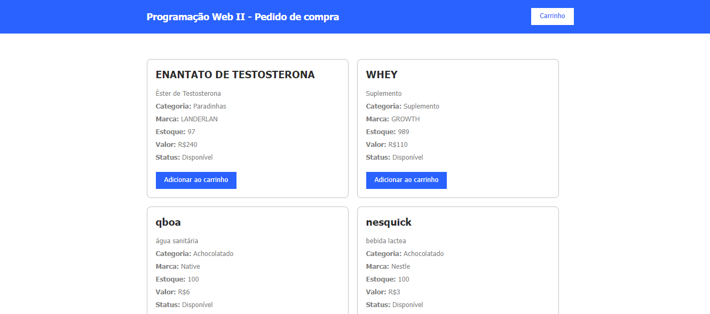
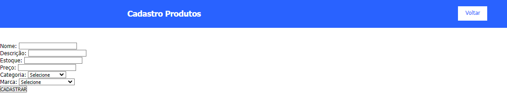
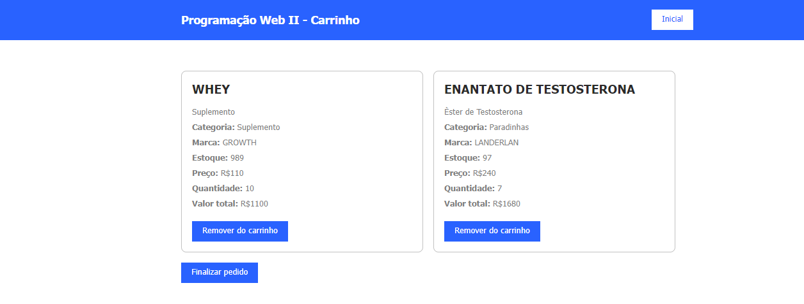
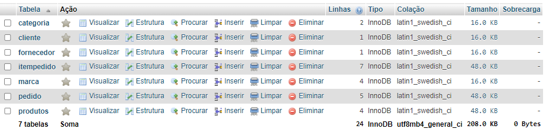

# Sistema de Cadastro e Visualização de Produtos para Ecommerce

## Descrição do Projeto

Este projeto consiste em um sistema para cadastro de produtos, marcas e categorias destinado a um ecommerce. Além disso, oferece a funcionalidade de visualização do carrinho de compras. Foi desenvolvido utilizando PHP e MySQL, com uma interface construída em HTML e CSS.


### Funcionalidades Principais

1. **Cadastro de Produtos**: Permite adicionar novos produtos ao sistema.

2. **Cadastro de Marcas**: Permite adicionar novas marcas ao sistema.

3. **Cadastro de Categorias**: Permite adicionar novas categorias ao sistema.

4. **Visualização do Carrinho**: Exibe os produtos adicionados ao carrinho.


### Estrutura do Projeto

O projeto é composto pelos seguintes arquivos principais:

- `carrinho.php`
- `categoria.php`
- `index.php`
- `insere-categoria.php`
- `insere-marca.php`
- `insere-produto.php`
- `marca.php`
- `pedido.php`
- `produtos.php`

Além disso, inclui arquivos secundários para JavaScript, modelos, CSS e controladores.

#### Descrição dos Arquivos

1. **carrinho.php**: Responsável por exibir o conteúdo do carrinho de compras, incluindo o arquivo `controller/carrinho-busca.php` para buscar e exibir os produtos no carrinho
```ruby <!DOCTYPE html>
<html>
  <head>
    <meta charset="utf-8">
    <title>Carrinho</title>
    <link rel="stylesheet" href="css/style.css" media="screen" title="no title" charset="utf-8">
    <script type="text/javascript" src="js/jquery-2.1.4.min.js"></script>
    <script type="text/javascript" src="js/script.js"></script>
  </head>
  <body>
    <header>
      <div class="center">
        <h1>Programação Web II - Carrinho</h1>
        <a href="index.php">Inicial</a>
      </div>
    </header>
    <section id="produtos">
        <div class="center">
          <?php require_once('controller/carrinho-busca.php'); ?>
        </div>
    </section>

  </body>
</html>
 ```
2. **categoria.php**: Usado para cadastrar novas categorias de produtos, contém um formulário que envia dados para `insere-categoria.php` via método POST.
```ruby <!DOCTYPE html>
<html lang="pt-br">
 
<head>
    <meta charset="utf-8">
    <title>Cadastrar Categorias</title>
    <link rel="stylesheet" href="css/style.css" media="screen" title="no title" charset="utf-8">
    <script type="text/javascript" src="js/jquery-2.1.4.min.js"></script>
    <script type="text/javascript" src="js/script.js"></script>
</head>
<body>
    <header>
        <div class="center">
            <h1>Cadastro de Categorias</h1>
            <a href="index.php" target="_self">Voltar</a>
        </div>
    </header>
    <section id="produtos">
        <form action="insere-categoria.php" method="post">
            <label for="">Descrição:</label>
            <input type="text" name="descricao">
            <input type="submit" value="Cadastrar">
           
             
        </form>
    </section>
</body>
</html> ```
3. **index.php**: Página inicial que exibe os produtos disponíveis, incluindo o arquivo `controller/produtos-busca.php` para buscar e exibir os produtos.
```ruby <!DOCTYPE html>
<html>
  <head>
    <!-- Material disponibilizado pelo professor Anderson Macedo -->
    <meta charset="utf-8">
    <title>Produtos</title>
    <link rel="stylesheet" href="css/style.css" media="screen" title="no title" charset="utf-8">
    <script type="text/javascript" src="js/jquery-2.1.4.min.js"></script>
    <script type="text/javascript" src="js/script.js"></script>
  </head>
  <body>
    <header>
      <div class="center">
        <h1 style="text-align: center">Programação Web II - Pedido de compra</h1>
        <a href="carrinho.php" target="_blank">Carrinho</a>
      </div>
    </header>
    <section id="produtos">
        <div class="center">
          <?php require_once('controller/produtos-busca.php'); ?>
        </div>
    </section>

  </body>
</html> ```
4. **insere-categoria.php**: Processa o formulário de cadastro de categorias e insere os dados no banco de dados após validar o formulário.
```ruby <?php
include('controller/conexao.php');
 
if ($_SERVER['REQUEST_METHOD'] == 'POST') {
    $descricao = $_POST['descricao'];
 
    if (empty($descricao)) {
        echo "<h3>Erro: Descrição é obrigatória!</h3><br><br>";
    } else {
        $cad_categoria = "INSERT INTO categoria (DESCRICAO) VALUES ('$descricao')";
        if (mysqli_query($mysqli, $cad_categoria)) {
            echo "<h1>Categoria Cadastrada com Sucesso!</h1><br>";
        } else {
            echo "Erro: ". mysqli_error($mysqli). "<br>";
        }
    }
}
 
mysqli_close($mysqli);
?> ```
5. **insere-marca.php**: Processa o formulário de cadastro de marcas e insere os dados no banco de dados após validação.
```ruby <?php
include('controller/conexao.php');
 
$descricao = $_POST['descricao'];
 
echo "<h3>Descrição: $descricao</h3><br><br>";
 
$cad_marca = "INSERT INTO marca (DESCRICAO) VALUES ('$descricao')";
 
if(mysqli_query($mysqli, $cad_marca)){
    echo "<h1>Marca cadastrada com sucesso!</h1><br>";
}else{
    echo "Erro: ". $cad_categoria . "<br>" . mysqli_error($mysqli);
}
 
mysqli_close($mysqli);
?> ```
6. **insere-produto.php**: Processa o formulário de cadastro de produtos, insere os dados no banco de dados e redireciona para a página de produtos com uma mensagem de sucesso ou erro.
```ruby <?php
include_once('controller/conexao.php');
 
$categoria = $_POST['seleciona_categoria'];
$marca = $_POST['seleciona_marca'];
$nome_produto = $_POST['nome'];
$descricao = $_POST['descricao'];
$estoque = $_POST['estoque'];
$preco = $_POST['preco'];
 
$grava_produto = "INSERT INTO produtos(IDCATEGORIA, IDMARCA, NOME, DESCRICAO, ESTOQUE, PRECO) VALUES ('$categoria','$marca','$nome_produto','$descricao','$estoque','$preco')";
 
$result_gravacao = mysqli_query($mysqli, $grava_produto);
 
if(mysqli_affected_rows($mysqli)  != 0){
    echo "
    <META HTTP-EQUIV=REFRESH CONTENT = 'O;URL=produtos.php'>
    <script type=\"text/javascript\">
    alert('Produto cadastrado com sucesso!');
    </script>
    ";
}else{
    echo "
    <META HTTP-EQUIV=REFRESH CONTENT = 'O;URL=produtos.php'>
    <script type=\"text/javascript\">
    alert('Problema no cadastro do produto!');
    </script>
    ";
 
} ```
7. **marca.php**: Usado para cadastrar novas marcas de produtos, contém um formulário que envia os dados para `insere-marca.php` via método POST.
```ruby 
<!DOCTYPE html>
<html lang="pt-br">

<head>
    <meta charset="utf-8">
    <title>Cadastrar marca</title>
    <link rel="stylesheet" href="css/style.css" media="screen" title="no title" charset="utf-8">
    <script type="text/javascript" src="js/jquery-2.1.4.min.js"></script>
    <script type="text/javascript" src="js/script.js"></script>
</head>
<body>
    <header>
        <div class="center">
            <h1>Cadastro de Marcas</h1>
            <a href="index.php" target="_self">Voltar</a>
        </div>
    </header>
    <section id="produtos">
        <form action="insere-marca.php" method="post">
          <label for="">Descrição:</label>
          <input type="text" name = "descricao">
          <input type="submit" value="Cadastrar">
        </form>
    </section>
</body>
</html>```
8. **pedido.php**: Exibe o resumo do pedido, incluindo o arquivo `controller/produtos-resumo.php` para buscar e exibir o resumo dos produtos do pedido.
```ruby <!DOCTYPE html>
<html>
  <head>
    <meta charset="utf-8">
    <title>Resumo de Pedido</title>
    <link rel="stylesheet" href="css/style.css" media="screen" title="no title" charset="utf-8">
    <script type="text/javascript" src="js/jquery-2.1.4.min.js"></script>
    <script type="text/javascript" src="js/script.js"></script>
  </head>
  <body>
    <header>
      <div class="center">
        <h1>Programação Web II - Resumo do Pedido</h1>
        <a href="index.php">Inicial</a>
      </div>
    </header>
    <section id="produtos">
        <div class="center">
          <div>
            <?php require_once('controller/produtos-resumo.php'); ?>
          </div>
        </div>
    </section>

  </body>
</html>
 ```
9. **produtos.php**: Utilizado para cadastrar novos produtos, contém um formulário que envia os dados para `insere-produto.php` via método POST e popula os selects de categoria e marca com dados do banco de dados.
```ruby <?php
    include_once ('controller/conexao.php')
?>

<!DOCTYPE html>
<html lang="pt-br">

<head>
    <meta charset="utf-8">
    <title>Cadastrar Produto</title>
    <link rel="stylesheet" href="css/style.css" media="screen" title="no title" charset="utf-8">
    <script type="text/javascript" src="js/jquery-2.1.4.min.js"></script>
    <script type="text/javascript" src="js/script.js"></script>
</head>
<body>
    <header>
        <div class="center">
            <h1>Cadastro Produtos</h1>
            <a href="index.php" target="_self">Voltar</a>
        </div>
    </header>
    <section id="produtos">
        <form action="insere-produto.php" method="post">
            Nome: <input type="text" name="nome"><br>
            Descrição: <input type="text" name="descricao"><br>
            Estoque: <input type="numer" name="estoque"><br>
            Preço: <input type="numer" name="preco" min="0.00" max="100000.00" step="0.01"><br>
            Categoria:
            <select name="seleciona_categoria" id="">
                <option value="">Selecione</option>
                <?php
                    $resultado_categoria = "SELECT * FROM  categoria";
                    $resultcategoria = mysqli_query($mysqli, $resultado_categoria);
                    while ($row_categorias = mysqli_fetch_assoc($resultcategoria)) {
                ?>
                
                <option value="<?php echo $row_categorias['IDCATEGORIA'];?>"><?php echo $row_categorias['DESCRICAO']; ?></option>

                <?php            
                    }
                ?>
            </select>
                <br>
            Marca:
            <select name="seleciona_marca" id="">
                <option value="">Selecione</option>
                <?php
                    $resultado_marca = "SELECT * FROM  marca";
                    $resultmarca = mysqli_query($mysqli, $resultado_marca);
                    while ($row_marcas = mysqli_fetch_assoc($resultmarca)) {
                ?>
                
                <option value="<?php echo $row_marcas['IDMARCA'];?>"><?php echo $row_marcas['DESCRICAO']; ?></option>

                <?php            
                    }
                ?>
            </select>
            <br>
            <input type="submit" value="CADASTRAR">
        </form>
    </section>
</body>
</html> ```
### Ferramentas Utilizadas

Para executar este projeto, é necessário ter o XAMPP e o phpMyAdmin instalados e configurados corretamente para gerenciar o banco de dados.

### Estrutura do Banco de Dados

O banco de dados foi estruturado de maneira a suportar as funcionalidades de cadastro e visualização de produtos, marcas e categorias.


### Fontes

- GitHub Docs
- Dio.me
- Chat,gpt
  
### Agradecimentos

Gostaríamos de expressar nossa gratidão ao professor Leo pela orientação e suporte ao longo deste projeto. Sua ajuda foi essencial para a realização deste trabalho.

## Contato
@Davi_Vellone
